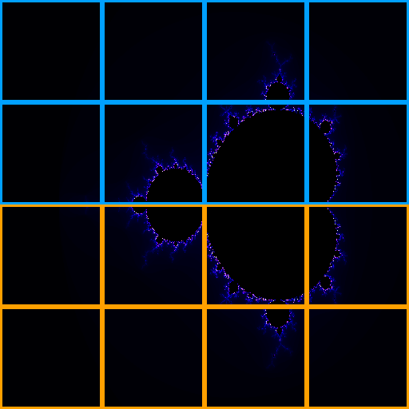

# Multi-Site Burst Renderer

A turnkey demo workflow for [Parallel Works ACTIVATE](https://www.parallel.works/) that renders a Mandelbrot fractal in parallel across two compute sites, with tiles assembling in real-time in a live browser dashboard.



## What It Does

1. **Splits work** across two ACTIVATE resources (e.g., an on-prem GPU server + a cloud Slurm cluster)
2. **Renders Mandelbrot tiles** in parallel — each site processes half the grid
3. **Streams tiles** via HTTP POST to a live dashboard running on the on-prem resource
4. **Displays results** in real-time through the ACTIVATE session proxy — tiles appear color-coded by source site

## Architecture

```
              ACTIVATE Workflow
                    │
         ┌──────────┴──────────┐
         ▼                      ▼
  Cloud Cluster (Slurm)   On-Prem (SSH)
  renders tiles 0..N/2    renders tiles N/2..N
         │                      │
         └──── POST tiles ──────┘
                    │
              Dashboard Server
              (on-prem:PORT)
                    │
            ACTIVATE Session Proxy
                    │
              User's Browser
```

## Quick Start

1. Start two ACTIVATE resources:
   - An **on-prem/existing** resource (e.g., `a30gpuserver`) — hosts the dashboard
   - A **cloud cluster** (e.g., `googlerockyv3`) — contributes rendering power
2. Run the workflow from the ACTIVATE UI or CLI:
   ```bash
   pw workflows run burst_renderer -i '{
     "onprem_resource": "pw://user/onprem_resource",
     "cloud_resource": "pw://user/cloud_cluster",
     "render_settings": {"grid_size": "8", "image_size": "256", "palette": "electric"}
   }'
   ```
3. Open the session link to watch tiles fill in live

## Inputs

| Input | Description | Options |
|-------|-------------|---------|
| On-Prem Resource | Always-on resource for dashboard + rendering | Any ACTIVATE resource |
| Cloud Resource | Cloud cluster for the other half of rendering | Any ACTIVATE cluster |
| Grid Size | Tiles per side (total = N x N) | 4x4, 8x8, 16x16, 32x32 |
| Tile Resolution | Pixel size of each tile | 128px, 256px, 512px |
| Color Palette | Mandelbrot coloring scheme | Electric, Fire, Ocean, Cosmic |

## Dashboard Features

- **Live canvas** — tiles render and appear in real-time
- **Site color-coding** — blue borders = cloud, orange borders = on-prem
- **Statistics** — elapsed time, tiles/sec, avg render time, total tiles
- **Throughput chart** — tiles/sec over time by site
- **Late-join support** — opening the dashboard after rendering shows all completed tiles

## File Structure

```
├── workflow.yaml              # ACTIVATE workflow definition
├── thumbnail.png              # Workflow thumbnail
├── README.md                  # This file
└── scripts/
    ├── setup.sh               # Verifies Python on remote hosts
    ├── start_dashboard.sh     # Launches FastAPI dashboard server
    ├── render_tiles.sh        # Renders tiles and POSTs to dashboard
    ├── dashboard.py           # FastAPI + WebSocket live dashboard
    ├── renderer.py            # Pure Python Mandelbrot renderer
    └── templates/
        └── index.html         # Dashboard UI (canvas + live stats)
```

## Requirements

- **Python 3.6+** on both compute resources
- **Pillow** (auto-installed; falls back to pure-Python PNG if unavailable)
- **FastAPI + Uvicorn** (auto-installed on the dashboard host)
- No GPU required — pure CPU rendering
